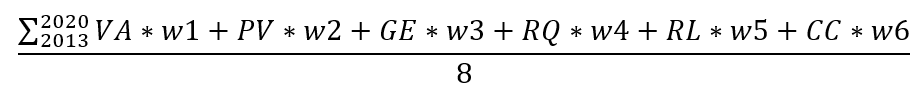
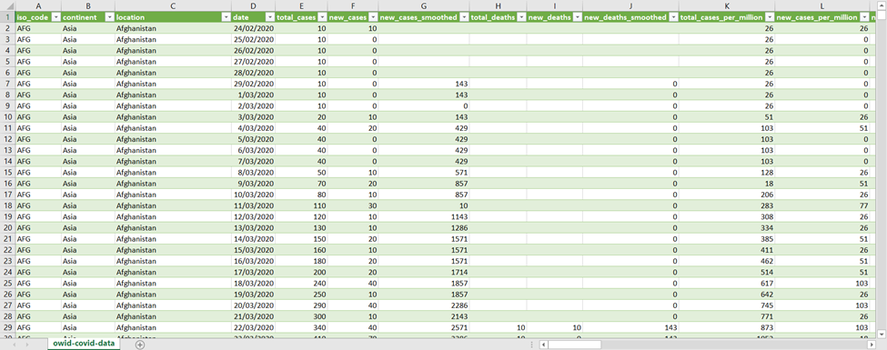

# El COVID 19 en la balanza política

## Justificación

El contexto geopolítico actual se ha visto afectado desde el 2019 por el virus COVID 19, aunque en los últimos meses se
han logrado desarrollar vacunas para poder contener el virus, el cese de actividades presenciales y la bancarrota de
muchos negocios ha afectado en gran medida la economía de distintos países y así mismo la calidad de vida de sus
poblaciones. Específicamente, en nuestro país Colombia, el creciente desempleo y las reformas económicas han generado
inestabilidad política resultando en una polarización de la población en dos bandos claros, izquierda y derecha; en este
sentido nos motiva identificar la existencia de una relación entre la manera en que ciertos países han sobrellevado
estas crisis en el ámbito de vacunación contra el virus según su inclinación política y de este modo tener claro si la
tendencia política de los países realmente supone una diferencia en el control del contagio y el tratamiento del mismo,
elegimos países democráticos para que los datos y análisis de la investigación sean imparciales.

## Pregunta de investigación

¿Cómo se relacionan las tasas de vacunación entre países democráticos respecto a sus diferentes tendencias políticas?

## Objetivo General

Determinar la relación entre las tendencias políticas de países democráticos con sus tasas de vacunación del COVID 19.

* Objetivos específicos:
    * Identificar la muestra poblacional a estudiar: Se tomarán dos países democráticos, uno con tendencia de izquierda
      y otro con tendencia de derecha de cada uno de los siguientes continentes: Asia, África, América, Europa y
      Oceanía.
    * Determinar el desempeño en la gestión del proceso de vacunación de cada país, respecto al promedio de su
      continente.
    * Determinar el desempeño en la gestión del proceso de vacunación de cada país, respecto a otros países con
      orientación política similar.

## ¿Qué tipo de investigación es?

Nuestra investigación tiene un **enfoque mixto**, pues implica la recoleccion de datos tanto cuantitativos como
cualitativos para su análisis en conjunto, las tendencias políticas son subjetivas (parte cualitativa) y las tasas de
vacunación son medibles (parte cuantitativa). En cuanto al **tipo**, se trata de una **investigación observacional**, 
**retrospectiva**, **longitudinal**, y **analítica**; pues se trata de un análisis bivariable, cuyos datos fueron medidos
a lo largo de un periodo de tiempo y recolectados por un tercero, sin intervención de los investigadores del presente
informe. En cuanto al **nivel**, se trata de una investigación **descriptiva y relacional**, pues busca describir
fenómenos sociales en una situación temporal y geográfica determinada para estimar parámetros, y su estadística
demuestra dependencia entre eventos más no relación de causa-efecto.

## Hipótesis de Investigación

* La tendencia política de un país se vincula de algún modo a sus tasas de vacunación. Los países más democráticos
  tienen un mejor desempeño en la vacunación que los países menos democráticos.
* **Hipótesis correlacional, direccional** porque se especifica la relacion (cómo es el efecto)
  entre la variable de segmentación (tendencia política) y la variable de contraste (tasa de vacunación).

## Matrix de Datos
<table>
  <tr>
    <td colspan="4" style="text-align: center"><b>Matriz de Datos</b></td>
  </tr>
  <tr>
    <td><b>Variable</b></td>
    <td><b>Tipo de Variable</b></td>
    <td><b>Tipo de Relación</b></td>
    <td><b>Fuente de los Datos</b></td>
  </tr>
  <tr>
    <td rowspan="3">Tasas de vacunación</td>
    <td rowspan="3">Cuantitativa Discreta</td>
    <td rowspan="3">Dependiente</td>
    <td>Institución estatal encargada de la salud en cada país</td>
  </tr>
  <tr>
    <td rowspan="1">OMS www.who.int</td>
  </tr>
  <tr>
    <td rowspan="1">https://ourworldindata.org/covid-vaccinations</td>
  </tr>

  <tr>
    <td>Orientación Política</td>
    <td>Cualitativa Nominal</td>
    <td>Independiente</td>
    <td>https://info.worldbank.org/governance/wgi/Home/downLoadFile?fileName=EIU.xlsx</td>
  </tr>
</table>

## Metodología de Tratamiento de Datos
En cuanto a la parte de la investigación que se rige bajo la **ruta cuantitativa**, 
el **mapa operativo es de tipo no experimental**, pues como se mencionó anteriormente 
las variables fueron tomadas anteriormente por un tercero y no se manipulan durante 
el presente proyecto; además es **longitudinal de panel**, porque se realizan varias 
mediciones de una **misma muestra** a través del tiempo.

### Definición de Variables
* **Conceptualmente:** Definición que explica cómo se va a entender la variable dentro del contexto de esta investigación.
  * **Orientación política:** Se entiende por cada país incluido en el estudio como una variable compuesta que representa 
si un país es más democrático o menos democrático en un sentido holístico y relativo en el que se tienen en cuenta tanto 
las elecciones la regulación que se lleva a cabo, control de corrupción y el Rule of Law.
  * **Tasa de vacunación:** Es como medimos el éxito que ha tenido cada país en cuestión en el control del 
coronavirus luego de que se empezaran a fabricar vacunas medido en términos se salud humana 
(y no económicamente por ejemplo).

* **Operacionalmente:** Procedimientos necesarios para medir una variable e interpretar los resultados.
  * **Orientación Política:** De la base de datos del World Bank, para llegar a la orientación política, 
tendremos en cuenta en un plazo de 8 años, que comprende de 2013-2020 las 6 macrovariables que esta base 
de datos nos provee:
    * Voice and Accountability (VA)
    * Political Stability and Absence of Violence (PV)
    * Government Effectiveness (GE)
    * Regulatory Quality (RQ)
    * Rule of Law (RL)
    * Control of Corruption (CC)
    
    Para llegar a la representación cualitativa, planteamos hacer una suma por peso de cada una de estas 
    6 variables expuestas en los 8 años y luego dividir entre 8, efectivamente promediándolas:

    

    Luego de obtener el valor numérico de dicha suma por peso determinamos cada país de la siguiente forma:
    * Más democrático: Su suma por peso está en el percentil [50, 100]
    * Menos democrático: Su suma por peso está en el percentil [0, 50)
  * **Tasa de vacunación:** Para medir esta variable contamos con la base de datos brindada por la OMS. 
  En primer lugar, se planea “limpiar” la base de datos, en tanto que se debe eliminar la información 
  que no es del interés especifico de esta investigación tales como “reproduction rate”, 
  “new tests”, “diabetes prevalence”, entre otros campos, para así poder enfocar la información 
  relevante tal como lo es “location”, “population”, “total vaccination”, “gdp per capita” etc. 
  Similarmente se deben filtrar los datos para los países objetivo solamente.  
  Por otro lado, se 
  organizará la información en tablas diferentes que permitan clasificar de manera más sencillas 
  los datos de cada país, según la evolución de casos y la tasa de vacunación, y sus características 
  económicas y demográficas.  
  Una vez hecho esto, es posible relacionar las variables de interés en 
  diferentes plataformas, por ejemplo, **Power BI**, con el objetivo de identificar tendencias y así 
  poder llegar a la respuesta de la pregunta de investigación inicial en la que se busca encontrar 
  la existencia y el tipo de relación entre la tendencia política de paises democráticos y su 
  desempeño durante la pandemia del COVID-19, específicamente respecto a la tasa de vacunación.

  
## Integrantes

- Maria Paula Balaguera Contreras
- Said Simon Aljure Quintero
- Jose Luis Acevedo Porras
- Alejandra Sofía Alarcón Ramírez
