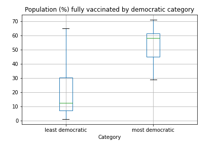

# El COVID 19 en la balanza política

## Justificación

El contexto geopolítico actual se ha visto afectado desde el 2019 por el virus COVID 19, aunque en los últimos meses se
han logrado desarrollar vacunas para poder contener el virus, el cese de actividades presenciales y la bancarrota de
muchos negocios ha afectado en gran medida la economía de distintos países y así mismo la calidad de vida de sus
poblaciones. Específicamente, en nuestro país Colombia, el creciente desempleo y las reformas económicas han generado
inestabilidad política resultando en una polarización de la población en dos bandos claros, izquierda y derecha; en este
sentido nos motiva identificar la existencia de una relación entre la manera en que ciertos países han sobrellevado
estas crisis en el ámbito de vacunación contra el virus según su inclinación política y de este modo tener claro si la
tendencia política de los países realmente supone una diferencia en el control del contagio y el tratamiento del mismo,
elegimos países democráticos para que los datos y análisis de la investigación sean imparciales.

## Pregunta de investigación

¿Cómo se relacionan las tasas de vacunación entre países democráticos respecto a sus diferentes tendencias políticas?

## Objetivo General

Determinar la relación entre las tendencias políticas de países democráticos con sus tasas de vacunación del COVID 19.

* Objetivos específicos:
    * Identificar la muestra poblacional a estudiar: Se tomarán dos países democráticos, uno con tendencia de izquierda
      y otro con tendencia de derecha de cada uno de los siguientes continentes: Asia, África, América, Europa y
      Oceanía.
    * Determinar el desempeño en la gestión del proceso de vacunación de cada país, respecto a otros el porcentaje de
      vacunación en los países democráticos.
    * Determinar el desempeño en la gestión del proceso de vacunación de cada país, respecto a otros países con
      orientación política similar.

## ¿Qué tipo de investigación es?

Nuestra investigación tiene un **enfoque mixto**, pues implica la recoleccion de datos tanto cuantitativos como
cualitativos para su análisis en conjunto, las tendencias políticas son subjetivas (parte cualitativa) y las tasas de
vacunación son medibles (parte cuantitativa). En cuanto al **tipo**, se trata de una **investigación observacional**,
**retrospectiva**, **longitudinal**, y **analítica**; pues se trata de un análisis bivariable, cuyos datos fueron
medidos a lo largo de un periodo de tiempo y recolectados por un tercero, sin intervención de los investigadores del
presente informe. En cuanto al **nivel**, se trata de una investigación **descriptiva y relacional**, pues busca
describir fenómenos sociales en una situación temporal y geográfica determinada para estimar parámetros, y su
estadística demuestra dependencia entre eventos más no relación de causa-efecto.

## Hipótesis de Investigación

* La tendencia política de un país se vincula de algún modo a sus tasas de vacunación. Los países más democráticos
  tienen un mejor desempeño en la vacunación que los países menos democráticos.
* **Hipótesis correlacional, direccional** porque se especifica la relacion (cómo es el efecto)
  entre la variable de segmentación (tendencia política) y la variable de contraste (tasa de vacunación).

## Matriz de Datos

<table>
  <tr>
    <td colspan="4" style="text-align: center"><b>Matriz de Datos</b></td>
  </tr>
  <tr>
    <td><b>Variable</b></td>
    <td><b>Tipo de Variable</b></td>
    <td><b>Tipo de Relación</b></td>
    <td><b>Fuente de los Datos</b></td>
  </tr>
  <tr>
    <td rowspan="3">Tasas de vacunación</td>
    <td rowspan="3">Cuantitativa Discreta</td>
    <td rowspan="3">Dependiente</td>
    <td>Institución estatal encargada de la salud en cada país</td>
  </tr>
  <tr>
    <td rowspan="1">OMS www.who.int</td>
  </tr>
  <tr>
    <td rowspan="1">https://ourworldindata.org/covid-vaccinations</td>
  </tr>

  <tr>
    <td>Orientación Política</td>
    <td>Cualitativa Nominal</td>
    <td>Independiente</td>
    <td>https://info.worldbank.org/governance/wgi/Home/downLoadFile?fileName=EIU.xlsx</td>
  </tr>
</table>

## Metodología de Tratamiento de Datos

En cuanto a la parte de la investigación que se rige bajo la **ruta cuantitativa**, el **mapa operativo es de tipo no
experimental**, pues como se mencionó anteriormente las variables fueron tomadas anteriormente por un tercero y no se
manipulan durante el presente proyecto; además es **longitudinal de panel**, porque se realizan varias mediciones de
una **misma muestra** a través del tiempo.

### Definición de Variables

* **Conceptualmente:** Definición que explica cómo se va a entender la variable dentro del contexto de esta
  investigación.
    * **Orientación política:** Se entiende por cada país incluido en el estudio como una variable compuesta que
      representa si un país es más democrático o menos democrático en un sentido holístico y relativo en el que se
      tienen en cuenta tanto las elecciones la regulación que se lleva a cabo, control de corrupción y el Rule of Law.
    * **Tasa de vacunación:** Es como medimos el éxito que ha tenido cada país en cuestión en el control del coronavirus
      luego de que se empezaran a fabricar vacunas medido en términos se salud humana
      (y no económicamente por ejemplo).

* **Operacionalmente:** Procedimientos necesarios para medir una variable e interpretar los resultados.
    * **Orientación Política:** De la base de datos del World Bank, para llegar a la orientación política, tendremos en
      cuenta en un plazo de 8 años, que comprende de 2013-2020 las 6 macrovariables que esta base de datos nos provee:
        * Voice and Accountability (VA)
        * Political Stability and Absence of Violence (PV)
        * Government Effectiveness (GE)
        * Regulatory Quality (RQ)
        * Rule of Law (RL)
        * Control of Corruption (CC)

      Para llegar a la representación cualitativa, planteamos hacer una suma por peso de cada una de estas 6 variables
      expuestas en los 8 años y luego dividir entre 8, efectivamente promediándolas:

      

      Luego de obtener el valor numérico de dicha suma por peso determinamos cada país de la siguiente forma:
        * Más democrático: Su suma por peso está en el percentil [50, 100]
        * Menos democrático: Su suma por peso está en el percentil [0, 50)

      Para sintetizar este valor usamos el lenguaje de programación Python, la librería Pandas para el manejo de datos y
      Matplotlib para graficar.
    * **Tasa de vacunación:** Para medir esta variable contamos con la base de datos brindada por la OMS. En primer
      lugar, se planea “limpiar” la base de datos, en tanto que se debe eliminar la información que no es del interés
      especifico de esta investigación tales como “reproduction rate”, “new tests”, “diabetes prevalence”, entre otros
      campos, para así poder enfocar la información relevante tal como lo es “location”, “population”, “total
      vaccination”, “gdp per capita” etc. Similarmente se deben filtrar los datos para los países objetivo
      solamente.  
      Por otro lado, se organizará la información en tablas diferentes que permitan clasificar de manera más sencillas
      los datos de cada país, según la evolución de casos y la tasa de vacunación, y sus características económicas y
      demográficas.  
      Una vez hecho esto, es posible relacionar las variables de interés en diferentes plataformas, por ejemplo, **Power
      BI**, con el objetivo de identificar tendencias y así poder llegar a la respuesta de la pregunta de investigación
      inicial en la que se busca encontrar la existencia y el tipo de relación entre la tendencia política de paises
      democráticos y su desempeño durante la pandemia del COVID-19, específicamente respecto a la tasa de vacunación.

  

## Resultados

Partimos de las bases de datos presentadas en la matriz de datos y las analizamos en PowerBI y Python para guiar el
estudio de nuestra hipótesis. A continuación mostraremos gráficas que sintetizan los hallazgos.

### Resultados comparando pares de países de izquierda vs de derecha

  
  
  
  
  

### Resultados de categorización entre países más y menos democráticos

  
  

### Resultados aglomerativos entre países de izquierda y de derecha

  
  
  
  
  

## Análisis de Resultados

**Nota:** Para el análisis se tomaron en cuenta los datos de personas <i>
completamente vacunadas</i>.

- Las gráficas permiten comparar la evolución de la vacunación entre los dos paises seleccionados por continente a lo
  largo del año 2021, versus su tasa de vacunación a la fecha. Los paises que se denotan con azul claro tienen una
  tendencia izquierdista, y los que se denotan con azul oscuro tienen una tendencia de derecha. Podemos ver como patrón
  general que todos los paises a comparar inician la vacunación alrededor de las mismas fechas, sin embargo, a partir de
  allí tiene un comportamiento bastante diferente.  
  Para los continentes americano y asiático vemos que, aunque los paises con tendencia a izquierda (Argentina y Japón)
  tienen una mayor cantidad de personas vacunadas para el mes de Octubre, son los paises con tendencia a derecha (Chile
  y Singapur) los que resultan con una mayor tasa de vacunación puesto que cuentan con una menor población total (
  Argentina 45 millones vs Chile 19 millones; japón 125 millones vs Singapur 5.6 millones), de modo que la población
  vacunada compone un mayor porcentaje respecto a su población local.  
  Para el continente oceánico vemos que, aunque Australia (tendencia a izquierda) tiene un mayor numero de personas
  vacunadas, ambos países cuentan con una tasa de vacunación muy similar (0.60 vs 0.61), y al comparar su población (
  Australia 25.69 millones vs Nueva Zelandia 5 millones) podemos afirmar que ambos tienen el mismo desempeño en relación
  con su propia capacidad y a su objetivo específico.  
  Finalmente, para los continentes europeo y africano vemos que, los paises con tendencia a izquierda (España y Egipto)
  tienen una mayor cantidad de personas vacunadas y son ellos mismos los que resultan con una mayor tasa de vacunación.
  Para el caso de europeo, España cuenta con una mayor población que Austria (47 millones vs 8.9 millones); y para el
  caso Africano Egipto cuenta con una menor población que Nigeria (102 millones vs 206 millones).
- Luego de sintetizar puntajes democráticos a cada país según la base de datos del Banco Mundial, cada país fue
  clasificado entre 'más democrático' o 'menos democrático', se puede observar en el diagrama de cajas que los países
  más democráticos lograron mejores tasas de vacunación total con una media de 54.07% frente a 17.70% de los no
  democráticos, además de tener una menor dispersión entre ellos. Al observar el diagrama de dispersión, se puede
  observar que hay una correlación entre las tasas de vacunación y el puntaje democrático de cada país aparentemente
  lineal.
- La diferencia en el porcentaje de vacunacion promedio de países de derecha e izquierda es de 1.5% siendo los países de
  derecha los que más población tienen vacunada respecto a los de izquierda, con 4/5 países por arriba de la media,
  siendo Egipto y Nigeria los únicos que se encuentran por debajo de la media, un factor a tener en cuanta es que los
  países que se encuentran por debajo de la media pertenecen al continente Africano que tiene el menor porcentaje de
  vacunacion (2,7%) entre continentes. La diferencia entre países de derecha e izquierda no es significativa.

## Conclusiones

- Si bien el numero de personas vacunadas mes a mes en cada país muestra la evolución de la vacunación y permite saber
  qué tan diligentes fueron los países al momento de frenar los contagios en el tiempo, no es un valor que permita
  comparar el desempeño entre paises, pues también se debe tener en cuenta la población total de cada uno de ellos como
  un referente sobre el cual se mide la tasa de vacunación, el cual a su vez permite analizar la efectividad de cada
  país en su propio contexto.
- Existe una diferencia marcada entre países al compararlos en el eje democrático. Están claramente relacionados, sin
  embargo no es posible concluir que el éxito de la vacunación se debe exclusivamente al nivel democrático, pues el
  determinar causalidad no fue el objetivo de este estudio.
- Con los datos analizados concluimos una relación no significativa entre proceso de vacunacion y la orientación
  política, por lo tanto la diferencia en las tasas de vacunación no puede ser justificada con la orientación política.

## Integrantes

- Maria Paula Balaguera Contreras
- Said Simon Aljure Quintero
- Jose Luis Acevedo Porras
- Alejandra Sofía Alarcón Ramírez
